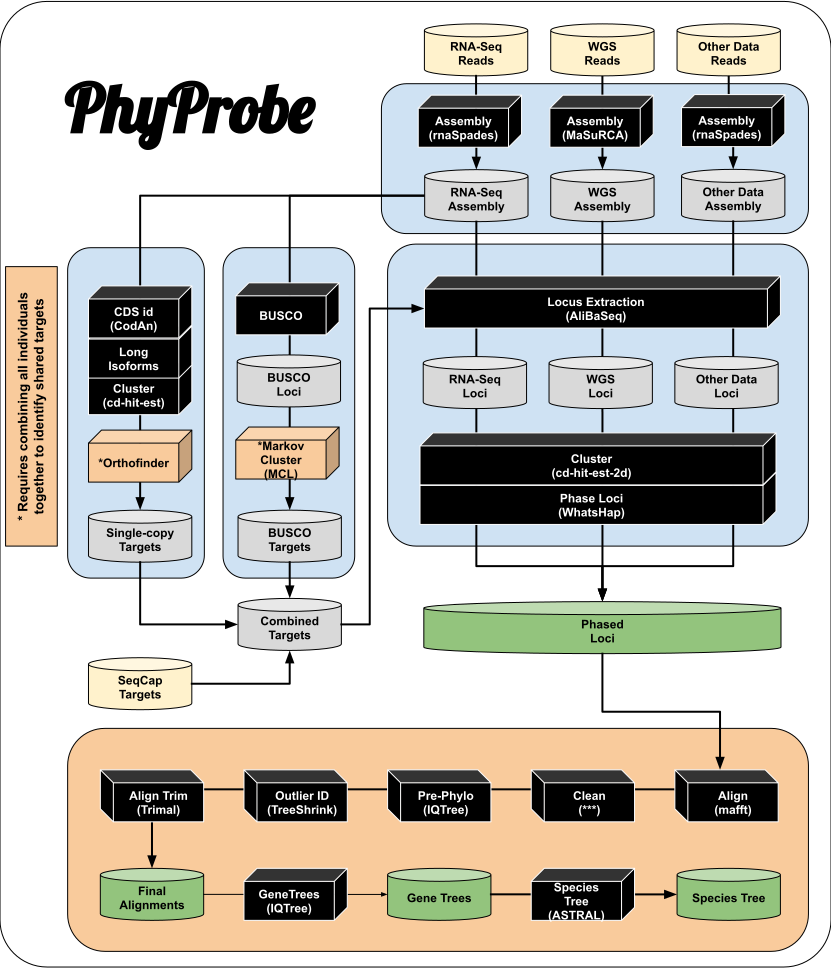

```
       __   ____  _           ____            _           
   ___|    |  _ \| |__  _   _|  _ \ _ __ ___ | |__   ___  
  |   |__  | |_) | '_ \| | | | |_) | '__/ _ \| '_ \ / _ \ 
--|        |  __/| | | | |_| |  __/| | | (_) | |_) |  __/ 
  |______  |_|   |_| |_|\__, |_|   |_|  \___/|_.__/ \___| 
                        |___/                             
```

## Rhett M. Rautsaw

***

<center>
🚧 This pipeline is under construction 🚧

Feel free to try to use anything in here, but I make no promises that it will work as it is supposed to.
</center>

***

**PhyProbe** is a bioinformatic pipeline designed to extract phylogenetic loci from Next-Generation Sequencing datasets including RNAseq, WGS, and Sequence/Target Capture methodologies (e.g., AHE, UCEs).

Specifically, **PhyProbe** extracts three categories of loci:
1. BUSCO Loci
2. Provided Target Loci (e.g., AHE or UCEs)
3. Misc. protein-coding genes (RNAseq data only)

If using multiple datatypes (multi-omics), we recommend processing RNAseq data first since it is a versatile datatype. By processing RNAseq data first, you can capture BUSCOs and Transcripts that can then be used as targets for the other additional datatypes. Not only will this speed up processing, but ensures that paralogs are removed from BUSCO results and that additional Transcript-based loci can be captured from other datatypes.

# Installation
The list of dependencies is a mile long... I will work on containerizing later, but for now this is the best I can do. We recommend installing them via [Anaconda](https://www.anaconda.com/products/distribution)/[Mamba](https://github.com/mamba-org/mamba) as below.

Dependencies include: [biopython](https://biopython.org/), [pandas](https://pandas.pydata.org/), [numpy](https://numpy.org/), [p-tqdm](https://github.com/swansonk14/p_tqdm), [spades](http://cab.spbu.ru/software/spades/), [busco](https://busco.ezlab.org/), [codan](https://github.com/pedronachtigall/CodAn), [blast](https://blast.ncbi.nlm.nih.gov/Blast.cgi), [cd-hit](http://weizhong-lab.ucsd.edu/cd-hit/), [seqtk](https://github.com/lh3/seqtk), [orthofinder](https://github.com/davidemms/OrthoFinder), [minimap2](https://github.com/lh3/minimap2), [bwa](http://bio-bwa.sourceforge.net/), [samtools/bcftools](http://www.htslib.org/), [whatshap](https://whatshap.readthedocs.io/en/latest/), [mafft](https://mafft.cbrc.jp/alignment/software/), [trimal](http://trimal.cgenomics.org/), [iqtree](http://www.iqtree.org/), [treeshrink](https://github.com/uym2/TreeShrink), and [dfply](https://github.com/kieferk/dfply). 

```
conda create -n phyprobe mamba
conda activate phyprobe
mamba install biopython pandas numpy p-tqdm pyfastx \
	masurca spades busco codan blast mcl \
	cd-hit seqtk orthofinder \
	minimap2 bwa samtools whatshap \
	mafft trimal iqtree
mamba install -c smirarab treeshrink

pip install cialign
pip install dfply

# PhyProbe
git clone https://github.com/RhettRautsaw/PhyProbe.git
cd PhyProbe/scripts

# AliBaSeq
git clone https://github.com/AlexKnyshov/alibaseq.git
echo "export PATH=\$PATH:$PWD/alibaseq" >> ~/.bashrc

# Add PhyProbe/scripts to PATH
echo "export PATH=\$PATH:$PWD" >> ~/.bashrc
```

# Pipeline

**PhyProbe** has several different modes. Below are the steps each mode will go through.

**Individual-sample analysis modes:**

Here, `-i` will be a folder for a single sample with the fastq(.gz) files inside and any previously completed steps.
- `-m rna`: assembly (rnaspades), BUSCO, transcript capture (CodAn), target capture (AliBaSeq), clustering (cd-hit-est), phasing (WhatsHap)
- `-m wgs`: assembly (MaSuRCA), BUSCO, target capture, clustering, phasing
- `-m other`: assembly (rnaspades), BUSCO, target capture, clustering, phasing

**Grouped-sample analysis modes:**

Here, `-i` will be a text file/list with each line being a single sample/folder to include in the analysis.
- `-m ortho`: OrthoFinder
- `-m mcl`: MCL
- `-m phylo`: combine samples, separate loci, align (mafft), trim (trimal & CIAlign), outlier removal (IQTree & Treeshrink), missing data filtering, & gene tree inference (IQTree)



# Running PhyProbe
## Setup
```
Directory/
├── sample_001
|	├── sample_001_R1.fastq.gz
|	└── sample_001_R2.fastq.gz
├── sample_002
|	├── sample_002_R1.fastq.gz
|	└── sample_002_R2.fastq.gz
├── samples.list
└── targets.fasta
```

## Arguments

| Flag           | Description                 |
|----------------|-----------------------------|
| -m, --mode     | **REQUIRED**: Analysis mode. <br/> Single sample options: [rna, wgs, other]. <br/> All sample options: [mcl, ortho, phylo] (default: None) |
| -i, --input    | **REQUIRED**: <br/>For -m [rna, wgs, other]: a folder with DNA/RNA read data and/or previously completed steps for a single sample. Folder name should correspond to sample name as it will used as a prefix in each step. <br/> For -m [mcl, ortho, phylo]: a txt file with a list of samples/folders. <br/> PhyProbe will autodetect which step to resume a previous analysis. (default: None) |
| -d, --delim    | Delimiter used to separate gene or locus names from sample names. For example, Locus0001\|SampleName. (default: '\|') |
| | |
| --busco      | **Required for BUSCO Capture steps**: Path to downloaded BUSCO db, name of BUSCO db to download, or \'auto\'. If not provided identification of BUSCO loci will be skipped (unless already finished and provided in target database). (default: None) |
| --codan        | **Required for Transcript Capture steps**: Path to CodAn model for transcriptome CDS prediction. If not provided identification of additional transcripts will be skipped (unless already finished and provided in target database). (default: None) |
| --targets      | **Required for Additional Target Capture step**: Fasta with targets from which to extract loci. If not provided identification of target loci will be skipped. (default: None) |
| | |
| -c, --cpu      | Number of threads to be used in each step. (default: $CPUs) |
| -mem, --memory | Max amount of memory for assembly. Only applicable for rnaSpades assembly. (default: $MEM) |
| --nodes        | File with list of HPC nodes that you can ssh into to parallelize alignments and trimming. Only applicable for -m phylo. (default: None) |

## Tutorial
Run RNA samples from Assembly --> CodAn
```
PhyProbe.py -m rna -i SAMPLE-NAME --busco tetrapoda_odb10 --codan VERT_full --targets TARGETS_db.fasta -c 16 -m 62
```

With all the RNA samples run through BUSCO and CodAn transcript identification, we can create some cleaned databases for more accurate extraction of loci and use in the other datatypes. 

Create a cleaned BUSCO database (removing paralogs).
```
PhyProbe -m mcl -i rna_samples.list -c 16
```

Create a Transcript database.
```
PhyProbe -m ortho -i rna_samples.list -c 16
```

Now we can go back and continue locus extraction for our RNA samples by running the same command as above for the RNA samples
```
PhyProbe.py -m rna -i SAMPLE-NAME --busco tetrapoda_odb10 --codan VERT_full --targets TARGETS_db.fasta -c 16 -m 62
```

For the remaining datatypes (e.g., WGS, SeqCap, etc.), we can run a very similar command. However, I would like to note that once the databases are created above, that any string can be placed in the `--busco` and `--codan` flags and PhyProbe will automatically detect the created databases and use AliBaSeq to extract the loci rather than actually running BUSCO or CodAn.
```
PhyProbe.py -m other -i SAMPLE-NAME --busco anything --codan anything --targets TARGETS_db.fasta -c 16
PhyProbe.py -m wgs -i SAMPLE-NAME --busco anything --codan anything --targets TARGETS_db.fasta -c 16
```

Now we are ready for phylogenetics!
```
PhyProbe.py -m phylo -i all_samples.list -c 16
```

# Manual Walkthrough
If you can't install all the dependencies into one environment, this section will walk through the steps PhyProbe uses for you to replicate if you want. This section assumes you have multiple data types (multi-omics); therefore, we will start with the RNA-Seq data processing.

Note that all "custom scripts" can be found in this repository or the linked repository.

## 1.0 Processing RNA-Seq Samples
For **each** RNA sample, the following steps are taken:

### 1.1. Assembly (rnaSpades)
We first assemble the transcriptomes using rnaSpades (or Trinity if you prefer).
```
rnaspades.py -1 SAMPLE-NAME_R1.fastq.gz -2 SAMPLE-NAME_R2.fastq.gz -t 16 -m 62 -o 01_assembly
```
Once complete, we recommend creating a copy of the assembly and simplifying the fasta headers of one copy for some downstream processing by BUSCO, CodAn, and AliBaSeq. `FastaRenamer` is a custom script that can be used to easily rename fasta headers.
```
cp 01_assembly/transcripts.fasta 01_assembly.fasta
cp 01_assembly.fasta 01_renamed.fasta
FastaRenamer.py -f 01_renamed.fasta -n contig
```

### 1.2 BUSCO
Next, we will run BUSCO (v5) to identify our first set of loci. We follow this up with `BuscoCleaner` - a custom script to produce fastas from the faa produced from BUSCO and check for 100% identical duplicates in the multi-copy loci. It will also rename all BUSCO fastas and concatenate them into a single file.
```
busco -i 01_renamed.fasta -c 16 -o 02_busco -m geno -l 2020-10_tetrapoda_odb10
BuscoCleaner.py -f 02_busco -a 01_renamed.fasta -n SAMPLE-NAME -d '|' -c 16
```

### 1.3. Transcript Identification (CodAn)
Next, we will run CodAn to identify potential coding sequences/transcripts in our assembly. We will follow this with `LongForms` - a custom script to extract the longest isoforms from a Trinity or rnaSpades assembly. Finally, we will cluster the sequences at 100% identity to remove redundancy.
```
codan.py -t 01_renamed.fasta -m /PATH/TO/CODAN/models/VERT_full -o  03_codan -c 16
cd 03_codan
LongForms.py -i ORF_sequences.fasta -o ORF_sequences.long.fasta
cd-hit-est -i ORF_sequences.long.fasta -o ORF_sequences.clust.fasta -c 1 -d 0
```

At this point, you should stop and create some databases from the preliminary BUSCO and CodAn results across all your samples.

## 2.0. Creating Reference Databases
Combining **all** samples together, we will create a BUSCO and Transcript database to re-extract loci in the RNA dataset as well as in the other datasets.

### 2.2. BUSCO Database
To create the cleaned BUSCO database and remove potential paralogs or misassignment by BUSCO, we will concatenate all of the sample's results together and then separate the data into a fasta for each locus using `SeqSorter` - a custom script designed to parse a concatenated fasta into multiple based a specified delimiter and position arguments
```
mkdir 00_mcl
cat */02_busco/*_busco.fasta >> 00_mcl/all_sample_buscos.fasta

cd 00_mcl
SeqSorter.py -i all_sample_buscos.fasta -d '|' -p 0 -c 16
```
We can then run Markov Clustering (MCL) on each fasta and keep the largest cluster as our "reference" sequences. The smaller clusters are likely paralogs and could lead to errors in alignment and phylogenetic inference.
```
ls SeqSorter/*.fasta | perl -pe 's/.*\///g' > 00_loci.list

# MCL Clustering & Keeping Largest Cluster as Reference
parallel -a 00_loci.list -j 16 --bar "
	MCL.py -i SeqSorter/{} --inflation 3 -m 1 -c 1 &> /dev/null
	"

# New BUSCO Database
cat MCL_out/*.fasta > BUSCO_db.fasta
perl -pe 's/\\" + delim + ".*//g' BUSCO_db.fasta > BUSCO_db_renamed.fasta
```

### 2.1. Transcript Database
To create the Transcript database, we will copy all of the CodAn results into a single folder. We will then run OrthoFinder which similarly performs MCL. We will follow orthofinder with `OrthoCleaner` - a custom script designed to extract single-copy orthologs with a certain allowance of missing data across your samples.
```
mkdir 00_ortho
parallel -a rna_samples.list -j 16 "
	cp {}/03_codan/ORF_sequences.clust.fasta 00_ortho/{}_ORFs.fasta
	"

orthofinder -f 00_ortho -t 16 -d -og -o 00_ortho_res
OrthoCleaner.py -f 00_ortho_res -d '|' -c 16 -p 50
```

## 3.0. Extracting Loci
We can now use the databases above to extract more confident orthologs from the RNA-Seq data as well as search for additional loci in the other datatypes (e.g., SeqCap, WGS, etc.)

### 3.1 Assembly (rnaSpades or MaSuRCA)
If the data were not already assembled above, you will first want first assemble it using either rnaSpades (for RNA, SeqCap, etc.)
```
rnaspades.py -1 SAMPLE-NAME_R1.fastq.gz -2 SAMPLE-NAME_R2.fastq.gz -t 16 -m 62 -o 01_assembly
```
or MaSuRCA (for WGS)
```
mkdir 01_assembly; cd 01_assembly
masurca -t 16 -i ../SAMPLE-NAME_R1.fastq.gz ../SAMPLE-NAME_R2.fastq.gz
mv CA/primary.genome.scf.fasta 01_assembly.fasta
```

Once complete, we recommend creating a copy of the assembly and simplifying the names of one copy for some downstream processing by AliBaSeq. `FastaRenamer` can be found in this repository.
```
cp 01_assembly/transcripts.fasta 01_assembly.fasta
cp 01_assembly.fasta 01_renamed.fasta
FastaRenamer.py -f 01_renamed.fasta -n contig
```

### 3.2. Target Capture (AliBaSeq)
We will use AliBaSeq to extract our final loci sets. To do this, we create a copy of our assembly and perform a BLAST search for the targets within our assembly. AliBaSeq will then use these BLAST results to amalgamate hits. Finally, we will use `AliBaSeqCleaner` - a custom script designed to rename fasta headers with your sample/locus name and concatentate into a final loci fasta for that sample. This pipeline will be applied three times for each of the loci categories (BUSCOs, Transcripts, Targets)

**BUSCOs**
```
cp 01_renamed.fasta 02_busco/tmp_assembly.fasta
cd 02_busco
makeblastdb -in tmp_assembly.fasta -dbtype nucl -parse_seqids
blastn -task dc-megablast -query PATH/TO/BUSCO_db.fasta -db tmp_assembly.fasta -outfmt 6 -out tmp_assembly.fasta.blast -evalue 1e-10 -num_threads 16
alibaseqPy3.py -x a -f S -b tmp_assembly.fasta.blast -t tmp_assembly.fasta -e 1e-10 --is --amalgamate-hits
AliBaSeqCleaner.py -f alibaseq_out -r PATH/TO/BUSCO_db.fasta -n SAMPLE-NAME -d '|' -c 16
```
**Transcripts**
```
cp 01_renamed.fasta 03_codan/tmp_assembly.fasta
cd 03_codan
makeblastdb -in tmp_assembly.fasta -dbtype nucl -parse_seqids
blastn -task dc-megablast -query PATH/TO/OrthoCleaner_renamed.fasta -db tmp_assembly.fasta -outfmt 6 -out tmp_assembly.fasta.blast -evalue 1e-10 -num_threads 16
alibaseqPy3.py -x a -f S -b tmp_assembly.fasta.blast -t tmp_assembly.fasta -e 1e-10 --is --amalgamate-hits
AliBaSeqCleaner.py -f alibaseq_out -r PATH/TO/OrthoCleaner_renamed.fasta -n SAMPLE-NAME -d '|' -c 16
```

**Targets**
```
cp 01_renamed.fasta 04_targets/tmp_assembly.fasta
cd 04_targets
makeblastdb -in tmp_assembly.fasta -dbtype nucl -parse_seqids
blastn -task dc-megablast -query PATH/TO/TARGETS.fasta -db tmp_assembly.fasta -outfmt 6 -out tmp_assembly.fasta.blast -evalue 1e-10 -num_threads 16
alibaseqPy3.py -x a -f S -b tmp_assembly.fasta.blast -t tmp_assembly.fasta -e 1e-10 --is --amalgamate-hits
AliBaSeqCleaner.py -f alibaseq_out -r PATH/TO/TARGETS.fasta -n SAMPLE-NAME -d '|' -c 16
```

### 3.3. Combine Loci
As there is overlap among these loci datasets (e.g., UCEs can often be found nested within longer BUSCOs), we will then perform a clustering to combine the three datasets. The following lines will cluster preferentially keeping BUSCOs first, then Targets, then Transcripts. 
```
05_combine
# Remove gaps from AliBaSeq results
Ungap.py -f 02_busco/SAMPLE-NAME_busco.fasta -o 05_combine/SAMPLE-NAME_busco.fasta
Ungap.py -f 03_codan/SAMPLE-NAME_targets.fasta -o 05_combine/SAMPLE-NAME_transcripts.fasta
Ungap.py -f 04_targets/SAMPLE-NAME_targets.fasta -o 05_combine/SAMPLE-NAME_targets.fasta
cd 05_combine

# Find Targets not already represented by BUSCOs and concatenate
cd-hit-est-2d -i SAMPLE-NAME_busco.fasta -i2 SAMPLE-NAME_targets.fasta -o SAMPLE-NAME_targets2.fasta -c 0.99 -d 0
cat SAMPLE-NAME_busco.fasta SAMPLE-NAME_targets2.fasta > SAMPLE-NAME_combo1.fasta

# Find Transcripts not already represented by BUSCOs or Targets and concatenate
cd-hit-est-2d -i SAMPLE-NAME_combo1.fasta -i2 SAMPLE-NAME_transcripts.fasta -o SAMPLE-NAME_transcripts2.fasta -c 0.99 -d 0
cat SAMPLE-NAME_combo1.fasta SAMPLE-NAME_transcripts2.fasta  > SAMPLE-NAME_nonredun.fasta
```

### 3.4. Phasing (Variant Calling & WhatsHap)
Finally, with the final loci fasta for each individual, we can perform phasing to retrieve both haplotypes for that locus. You can use the phased loci in a multi-coalescent framework to obtain a more confident species tree estimates. To do this, we will use [`VariantCaller`](github.com/rhettrautsaw/VariantCaller) - a custom script which will follow the GATK or bcftools best practices for SNP calling and filtering. It will also call WhatsHap to perform the phasing and then bedtools to re-create the full sequences with the phased variants in the sequence.
```
06_phased
cp 05_combine/SAMPLE-NAME_nonredun.fasta 06_phased/
cd 06_phased
VariantCaller.py -f SAMPLE-NAME_R1.fastq.gz SAMPLE-NAME_R2.fastq.gz -r SAMPLE-NAME_nonredun.fasta -s SAMPLE-NAME -c 16 --mpileup --haplotypes
cat 11_haplotype1.fasta 11_haplotype2.fasta > SAMPLE-NAME_phased.fasta
Ungap.py -f SAMPLE-NAME_phased.fasta
```

## 4.0 Phylogenetics
Now we are ready for alignment and gene tree inference...

### 4.1 Combining Samples & Separating Loci
First, we will combine/concatentate all the samples into a single fasta. We can then use `SeqSorter` again to separate the loci into individual fastas. After this, we will remove the locus information from the fasta headers (leaving only the sample names in the fasta headers).
```
# Concatenate Samples
mkdir 01_phylo
parallel -a all_samples.list -j 1 "
	cat {}/06_phased/{}_phased.fasta >> 01_phylo/all_sample_loci.fasta
	"
cd 01_phylo

# Separate Loci
SeqSorter.py -i all_sample_loci.fasta -d '|' -p 0 -c 16

# Create list of loci
ls SeqSorter/*.fasta | perl -pe 's/SeqSorter\///g' | perl -pe 's/.fasta//g' > 00_loci.list

# Remove loci from fasta headers
mkdir 00_seqs
parallel -a 00_loci.list -j 1 --workdir $PWD --bar --sshloginfile $SSH_NODES "
	perl -pe 's/^>.*?|/>/g' SeqSorter/{}.fasta > 00_seqs/{}.fasta
	"
```

### 4.2 Aligning and Trimming
Next, we will perform an alignment with MAFFT and several trimming steps with CIAlign, trimal, and `DropGappy` - a custom script to remove samples that cross a specified threshold for the amount of gaps in the alignment (70%).
```
mkdir 01_aln 02_CIAlign 03_trimal 04_dropgappy

parallel -a 00_loci.list -j 1 --workdir $PWD --bar --sshloginfile $SSH_NODES "
	# MAFFT alignment
	mafft --auto --adjustdirection accurately --thread 16 00_seqs/{}.fasta > 01_aln/{}.fasta
	
	# Remove information about adjusted directionality produced from MAFFT
	perl -pi -e 's/_R_//g' 01_aln/{}.fasta
	
	# CIAlign
	CIAlign --infile 01_aln/{}.fasta --outfile_stem 02_CIAlign/{} --remove_divergent --remove_divergent_minperc 0.80 --remove_insertions --crop_ends --remove_short
	
	# Trimal
	trimal -in 02_CIAlign/{}_cleaned.fasta -out 03_trimal/{}.fasta -gappyout
	
	# Drop
	DropGappy.py -i 03_trimal/{}.fasta -o 04_dropgappy/{}.fasta -c 70 -ug
	"
```

### 4.3. Outlier Removal (Treeshrink)
Next, we will re-align and infer preliminary gene trees. These gene trees will be used by Treeshrink to identify dubious sequences in each locus fasta. 

Treeshrink is a really neat program. Specifically, it will look across all of the genes to calculate the expected influence of a specific sample on tree diameter. For example, outgroups are expected to greatly increase tree diameter compared to ingroups. Therefore, if an ingroup sample greatly increases tree diameter in one specific locus/tree, it will be flagged as an outlier and removed from that alignment specifically (but retained in the trees where it was not flagged as an outlier). This method does well at removing potential paralogs that could influence tree inference. 
```
mkdir 05_trees 06_treeshrink

parallel -a 00_loci.list -j 1 --workdir $PWD --bar --sshloginfile $SSH_NODES "
	mkdir 06_treeshrink/{}
	mafft --auto --thread 16 04_dropgappy/{}.fasta > 05_trees/{}.fasta
	cd 05_trees
	iqtree -s {}.fasta -B 1000 -T 16
	cp {}.fasta ../06_treeshrink/{}/input.fasta
	cp {}.fasta.treefile ../06_treeshrink/{}/input.tree
	"

run_treeshrink.py -i 06_treeshrink -t input.tree -a input.fasta -c
```

### 4.4. Final Trimming
With outliers removed, we will perform one more round of trimming
```
mkdir 07_trimal

parallel -a 00_loci.list -j 1 --workdir $PWD --bar --sshloginfile $SSH_NODES "
	trimal -in 06_treeshrink/{}/output.fasta -out 07_trimal/{}.fasta -gappyout
	"
```

### 4.5. Filtering for Missing Data
If a loci is only found in 3 of 1000 loci, it is probably not very informative. We can filter for missing data using `FilterMissData` - a custom script to subset alignments for a specified amount of missingness on two different axes: 
1) Filter for genes with a certain % of total taxa
2) Filter for taxa with a certain % of total genes
```
cd 08_subsets
FilterMissData.py -f 07_trimal -o 08_subsets -c 16
```

### 4.6. Gene Tree Inference
Using genes with > 25% total taxa and taxa with > 5% total genes as final dataset
```
# Create list of loci
ls 08_subsets/Genes25Taxa_Taxa5Genes/*.fasta | perl -pe \'s/.*\///g' > 09_loci.list

# Run gene trees
parallel -a 09_loci.list -j 1 --workdir $PWD --bar --sshloginfile $SSH_NODES "
	cd 08_subsets/Genes25Taxa_Taxa5Genes 
	iqtree -s {} -B 1000 -T 16"

# Concatenate gene trees
cat 08_subsets/Genes25Taxa_Taxa5Genes/*.treefile > 09_genetrees.tre
```

### 4.7. Species Tree Inference
We recommend using Astral for species tree inference.
```
# Rename samples in gene trees so that '|' is replaced by '_' to avoid problems with Astral
perl -pe 's/\|/_/g' 09_genetrees.tree > 10_genetrees.tree

# Collapse branches with < 10% bootstrap support
nw_ed  10_genetrees.tree 'i & b<=10' o > 10_genetrees-BS10.tree

# Create a mapfile and run Astral
java -jar astral.5.15.4.jar -i 10_genetrees-BS10.tree -o 10_astral.tre -C -T 16 -a 10_mapfile.txt
```